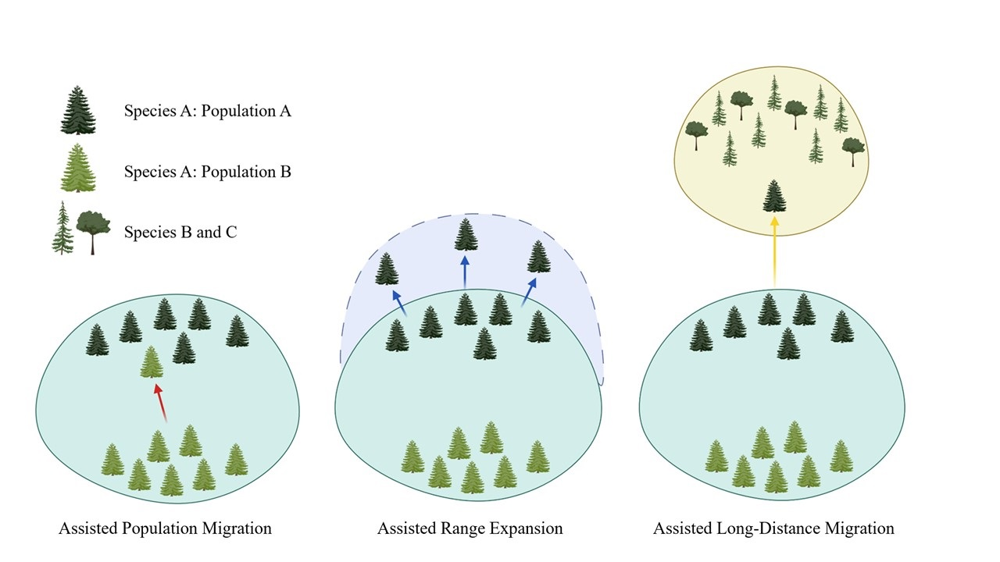

# Assisted Migration as a Response to Climate Change in The Boreal Forest
#### Shannon Buck, Hunter Clark, Khalil Husein, Anna Morley, Selvi Patel 

### The Boreal Forest and Climate Change

Found exclusively in the northernmost countries of the world, boreal forests nonetheless make up nearly one third of all forested regions (Gauthier et al., 2015). Their importance is often understated, providing residence for many human communities and a diverse range of wildlife (Carlson, Wells and Roberts, 2009). They also store a substantial amount of carbon and are a crucial source of timber (Carlson, Wells and Roberts, 2009). However, climate change is reducing boreal habitats and shifting tree species’ optimal ranges northwards, compromising the future survival of these forests (Natural Resources Canada, 2020). The frequency and intensity of forest fires and pest infestations have also increased, causing significant damage to these forests (Pureswaran, Roques, and Battisti, 2018; Johnstone and Walker, 2019). Preservation measures—such as the establishment of protected regions—have been implemented, but there remains debate on what further management practices to use (Natural Resources Canada, 2015). 

### What is Assisted Migration? 

Assisted migration (AM) is the human-administered movement of species to more climatically suitable regions (Government of Canada, 2013). Three types of AM can be implemented (Figure 1): assisted population migration (low-risk), assisted range expansion (intermediate-risk), and assisted long-distance migration (high-risk) (Government of Canada, 2013).  

*Figure 1: A diagram depicting the three main types of AM. Assisted population migration (left) is where a population within a species is migrated to an area within its species’ current range (green area) that is dominated by another population of the same species. Assisted range expansion (middle) is where a species of tree is migrated to the area adjacent to its current range (blue area). Assisted long-distance migration (right) is where a species is migrated to an area not adjacent to its current range, usually a long distance (yellow area). Figure created by authors using BioRender.*

### Potential Benefits of Assisted Migration

AM has the capability to save individual threatened species from extinction (McLachlan, Hellman and Schwartz, 2007; Aubin et al., 2011; Williams and Dumroese, 2013; Ste-Marie et al., 2014). In addition, AM could maintain or increase the genetic diversity of tree species by expanding the range of different genetic populations (Ste-Marie et al., 2014). AM also has the potential to increase the resiliency of forest ecosystems if similar tree species were moved together (Aubin et al., 2011). Lastly, AM provides socioeconomic benefits through conserving market-based forestry goods, related jobs, and nature-based recreational activities (Ste-Marie et al., 2014).

### Negative Impacts of Assisted Migration  

The main challenge of AM is the unpredictability of whether migrated species can survive in a new area. Additionally, AM may not be able to maintain biodiversity due to the threat of new predators (Johnstone and Chapin, 2003; Winder, Nelson and Beardmore, 2011) and migrated species may exert similar effects as invasive species on existing forest communities (Pedlar et al., 2012). Furthermore, AM may not be enough to mitigate the effects of climate change, as forest fires (Paul, Bergeron and Tremblay, 2014) and emissions from carbon sinks (Carlson, Wells and Roberts, 2009) pose a threat to the integrity and biodiversity of the boreal forest.  

### Feasibility and Applicability of Assisted Migration  

Implementing AM involves (Pedlar et al., 2011):
 1. Selecting the tree species to migrate 
 2. Establishing the appropriate seed migration distance 
 3. Procuring seed
 4. Selecting the planting site(s)
 5. Planting
 6. Tending 
 7. Monitoring and evaluating success

Accurate climate predictions and knowledge of how different species grow are important for each step. For instance, selecting a tree species for AM involves considering its economic value or threat of extinction, but also its risk of becoming invasive, its sensitivity to pests, diseases, and climate extremes in the new environment, and more. For common forestry trees, this information may already be known. However, species of conservation concern may need time-consuming and costly experimental trials (Pedlar et al., 2011). Overall, using AM in the forestry industry would likely lead to economic gains, (Pedlar et al., 2011; Klenk, 2015) while conservation-driven AM may be less economically viable (Pedlar et al., 2011; Palmer and Larson, 2014). 

### Conclusion

While there are examples of successful assisted migration in Canada, many uncertainties remain. For now, there is greater public support for using AM to increase diversity and forest resilience within a species’ existing range, rather than migrating large distances (Sáenz-Romero et al., 2021). However, AM on its own would likely not be enough. Forest management strategies, including potential AM initiatives, should be diversified to hedge against future uncertainties in the boreal forest. 

## References

Aubin, I., Garbe, C.M., Colombo, S., Drever, C.R., McKenney, D.W., Messier, C., Pedlar, J., Saner, M.A., Venier, L., Wellstead, A.M., Winder, R., Witten, E. and Ste-Marie, C., 2011. Why we disagree about assisted migration: Ethical implications of a key debate regarding the future of Canada’s forests. The Forestry Chronicle, 87(6), pp.755–766. 

Carlson, M., Wells, J. and Roberts, D., 2009. The Carbon the World Forgot: Conserving the Capacity of Canada’s Boreal Forest Region to Mitigate and Adapt to Climate Change. Seattle: Boreal Songbird Initiative. 

Gauthier, S., Bernier, P., Kuuluvainen, T., Shvidenko, A.Z. and Schepaschenko, D.G., 2015. Boreal forest health and global change. Science, 349(6250), pp.819–822. 

Government of Canada, 2013. Assisted Migration. [online] Government of Canada. Available at: <https://www.nrcan.gc.ca/climate-change/impacts-adaptations/climate-change-impacts-forests/adaptation/assisted-migration/13121> [Accessed 27 Feb. 2021]. 

Johnstone, J.F. and Chapin, F.S., 2003. Non-equilibrium succession dynamics indicate continued northern migration of lodgepole pine. Global Change Biology, 9(10), pp.1401–1409. 

Johnstone, J.F. and Walker, X., 2019. More frequent wildfires in the boreal forest threaten previously protected soil carbon. [online] EurekAlert! Available at: <https://www.eurekalert.org/pub_releases/2019-08/uos-mfw082119.php> [Accessed 28 Feb. 2021]. 

Klenk, N.L., 2015. The development of assisted migration policy in Canada: An analysis of the politics of composing future forests. Land Use Policy, 44, pp.101–109. 

McLachlan, J.S., Hellmann, J.J. and Schwartz, M.W., 2007. A Framework for Debate of Assisted Migration in an Era of Climate Change. Conservation Biology, 21(2), pp.297–302. 

Natural Resources Canada, 2015. Conservation and protection of Canada’s forests. [online] Natural Resources Canada. Available at: <https://www.nrcan.gc.ca/our-natural-resources/forests/sustainable-forest-management/conservation-and-protection-canadas-forests/17501> [Accessed 28 Feb. 2021]. 

Natural Resources Canada, 2020. Distribution of Tree Species. [Government] Government of Canada. Available at: <https://www.nrcan.gc.ca/climate-change/impacts-adaptations/climate-change-impacts-forests/forest-change-indicators/distribution-tree-species/17778> [Accessed 26 Feb. 2021]. 

Palmer, C. and Larson, B.M.H., 2014. Should We Move the Whitebark Pine? Assisted Migration, Ethics and Global Environmental Change. Environmental Values, 23(6), pp.641–662. 

Paul, V., Bergeron, Y. and Tremblay, F., 2014. Does climate control the northern range limit of eastern white cedar (Thuja occidentalis L.)? Plant Ecology, 215(2), pp.181–194. 

Pedlar, J., McKenney, D., Beaulieu, J., Colombo, S., McLachlan, J. and O’Neill, G., 2011. The implementation of assisted migrationin Canadian forests. The Forestry Chronicle. [online] Available at: <https://pubs.cif-ifc.org/doi/abs/10.5558/tfc2011-093> [Accessed 26 Feb. 2021]. 

Pedlar, J.H., McKenney, D.W., Aubin, I., Beardmore, T., Beaulieu, J., Iverson, L., O’Neill, G.A., Winder, R.S. and Ste-Marie, C., 2012. Placing Forestry in the Assisted Migration Debate. BioScience, 62(9), pp.835–842. 

Pureswaran, D.S., Roques, A. and Battisti, A., 2018. Forest Insects and Climate Change. Current Forestry Reports, 4(2), pp.35–50. 

Sáenz-Romero, C., O’Neill, G., Aitken, S.N. and Lindig-Cisneros, R., 2021. Assisted Migration Field Tests in Canada and Mexico: Lessons, Limitations, and Challenges. Forests, 12(1), p.9. 

Ste-Marie, C., Kavalinas, S., Price, D., Wrangler, E., Hopkins, K., Peterson, D., Snetsinger, J., Carlson, G., Klos, R., Bartlett, M., Ng, T., Norfolk, C., Kelly, W., Lakusta, T., Beyeler, J., Kierstead, J., Gray, P., McAskill, D., Campagna, M., Dye, D., Ogden, A., Sharples, R., Hirsch, K., Sheldan, T., Williamson, T., Bonneau, M.-E., Onoda, K., Johnston, M., Edwards, J., Price, D. and Isaac, K., 2014. Adapting Sustainable Forest Management to Climate Change: A review of assisted tree migration and its potential role in adapting sustainable forest management to climate change. [online] Canadian Council of Forest Ministers.pp.1–28. Available at: <https://www.ccfm.org/pdf/10_Assisted%20Migration%20_ENG.pdf> [Accessed 27 Feb. 2021]. 

Williams, M.I. and Dumroese, K.R., 2013. Preparing for Climate Change: Forestry and Assisted Migration. Journal of Forestry, 111(4), pp.287–297. 

Winder, R., Nelson, E. and Beardmore, T., 2011. Ecological implications for assisted migration in Canadian forests. The Forestry Chronicle, 87(6), pp.731–744. 

 
