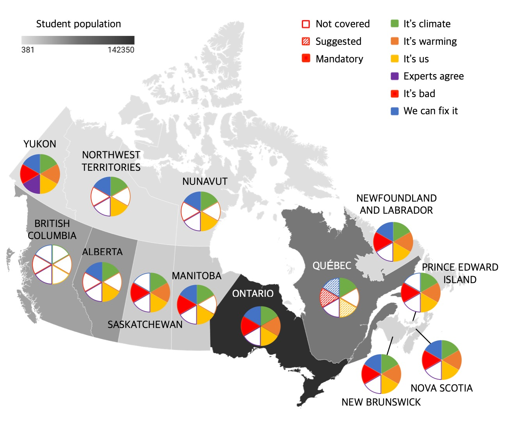

# Climate Change Education in Canada
By Bonny Chong, Jonathan Lai, Evlyn Sun & Maya Rajasingham

## Introduction
Climate change is a daunting issue that can only be resolved by creative and collaborative actions. Although education is not as popular as other solutions, it has an immense role in enabling future generations to call out and respond innovatively to unsustainable practices contributing to climate change (Cordero, Centeno and Todd, 2020). However, students commonly have misconceptions about climate change, demonstrating the need for a more refined education system (Lambert, Lindgren and Bleicher, 2012). Therefore, this study aims to address the challenges in climate change education and provide a foundation for effective teaching in Canada.

## Curriculum Analysis
To better understand the state of climate change education for grade eight students in Canada, we analyzed the grade eight science curriculums of each Canadian province and territory. We used the climate change curriculum framework outlined by Nicholas and colleagues (2014), which incorporates important messages and findings from the IPCC Fifth Assessment Report. Curriculums were evaluated based on its coverage of six core topics: *It’s climate*, *It’s warming*, *It’s us*, *Experts agree*, *It’s bad*, and *We can fix it*. Results showed that *It’s climate* and *It’s us* was covered by 12 out of 13 provinces/territories. Alarmingly, only one province/territory covered *Experts agree*, Yukon. In fact, Yukon had the most comprehensive coverage of climate change, covering all six core topics. Therefore, as Yukon demonstrates, a good curriculum should outline and accurately address all six core topics. It should also discuss climate change issues local to each province and territory to highlight its relevance to student’s personal lives.

  

**Figure 1**: Map showing a provincial and territorial breakdown of the student population and the coverage of the six climate change core topics. Each pie graph represents one core topic that indicates no coverage (blank rectangle), suggested coverage (striped-line rectangle), or mandatory coverage (solid coloured rectangle) within the curriculum.

## Teaching Strategies
Equipping Canada’s teachers with effective teaching strategies to supplement the proposed curriculum changes will lead to higher student engagement. Based on the review article written by Monroe and colleagues (2019), the four most impactful teaching methods include: 1) Engaging in discussion, 2) Interaction with scientists/experts/professionals in the field, 3) Addressing common misconceptions, and 4) Implementing school and community projects that incorporate student values. Current teachers are recommended to use some or all of the strategies provided to create a safe learning environment that allows students to properly deconstruct the situation on hand (Table 1). Furthermore, early research has shown that many teachers feel underprepared to teach the topic of climate change (Michail, Stamou and Stamou, 2007; Summers et al., 2000). It is suggested that current teaching programs implement modules or courses pertaining to climate change science based on the four teaching strategies to better facilitate knowledge transfer and the requisite skills to handle complex socioscientific issues. 

**Table 1**: Description of the four most effective climate change teaching strategies (Monroe et al., 2019).
Teaching Strategy | Practical Methods to Implement in the Classroom
------------ | -------------
Engaging in Discussion | Deliberative discussions are useful for breaking down complex concepts, comparing perceptions, understanding opinions and conducting personal reflection. Teachers should facilitate an open environment of discussion and provide many opportunities for students to share. | 
Interacting with Scientists and Science | Interaction with professionals helps students to design meaningful and relevant projects. Professionals are also able to aid with the process of data collection, hypothesis and project creation and analysis of data. Laboratory and botanical garden visits as potential day field trips help to inspire students about climate change science. |
Addressing Misconceptions | Most common misconception is the conflation of climate change and the ozone hole. Teachers should 1) encourage students to share their current knowledge, 2) take successive steps to untangle complex ideas and concepts, 3) narrow content down to focus on key learning objectives, and 4) avoid unnecessary technical terminology.|
Implementing school and community projects | Small projects and field trips help students to relate education in the classroom. Incorporating community related activities alongside theoretical concepts discussed in the classroom increases engagement and inspires students to self-educate outside of school.

## Conclusion

To secure the proper development and training of future scientific leaders, Canadian governments need to ensure that all six core topics are covered in science curriculums. These curriculums should be implemented using the four teaching strategies, including open discussions, the use of technology, and field trips to engage students. The strategies proposed by our analysis outline a basic blueprint for the Canadian curriculum to establish an effective and standardized climate change education across the country. It is recommended to continue evaluating and implementing climate change education in Canada to prepare the next generation for their uncertain future.

## References
Alasmari, A. and Ahmed, S.S., 2013. Using Debate in EFL Classes. English Language Teaching, 6(1), pp.147.

Alberta Education, 2014. Science (Elementary)  A.1(1996). [online] Alberta. Available at: <https://<i></i>education.alberta.ca/science-7-9/program-supports/>.

Alexandar, R. and Poyyamoli, G., 2012. Activity-Based Water Resources and Climate Change Education Among School Students in Puducherry. In: W. Leal Filho, ed. Climate Change and the Sustainable Use of Water Resources, Climate Change Management. [online] Berlin, Heidelberg: Springer.pp.557–578. Available at: <https://<i></i>doi.org/10.1007/978-3-642-22266-5_34> [Accessed 1 Mar. 2021].

Anderson, A., 2012. Climate Change Education for Mitigation and Adaptation. Journal of Education for Sustainable Development, 6(2), pp.191–206.
Berger, P., Gerum, N. and Moon, M., 2015. ‘Roll up Your Sleeves and Get at It!’ Climate Change Education in Teacher Education. Canadian Journal of Environmental Education, 20, pp.154–172.

Boyes, E. and Stanisstreet, M., 1993. The ‘Greenhouse Effect’: children’s perceptions of causes, consequences and cures. International Journal of Science Education, 15(5), pp.531–552.

British Columbia Ministry of Education, 2016. Area of Learning: Science. [pdf] British Columbia. Available at: <https://<i></i>curriculum.gov.bc.ca/sites/curriculum.gov.bc.ca/files/curriculum/science/en_science_k-9.pdf>.

Brody, M., 1996. An Assessment of 4th-, 8th-, and 11th-Grade Students’ Environmental Science Knowledge Related to Oregon’s Marine Resources. Journal of Environmental Education, 27(3), pp.21-27.

Butler, C.D., 2018. Climate Change, Health and Existential Risks to Civilization: A Comprehensive Review (1989–2013). International Journal of Environmental Research and Public Health, [online] 15(10). Available at: <https://www.ncbi.nlm.nih.gov/pmc/articles/PMC6210172/> [Accessed 7 Mar. 2021].

Cordero, E.C., Centeno, D. and Todd, A.M., 2020. The role of climate change education on individual lifetime carbon emissions. PLOS ONE, 15(2), p.e0206266.
Department of Education and Early Childhood Development, 2020. Science 8: Renewed Curriculum Gide. [pdf] Nova Scotia. Available at: <https://<<i></i>curriculum.novascotia.ca/sites/default/files/documents/curriculum-files/Science%208%20Guide%20R%20%282020-21%29.pdf>.

Dietz, M.E., Clausen, J.C. and Filchak, K.K., 2004. Education and Changes in Residential Nonpoint Source Pollution. Environmental Management, 34(5), pp.684–690.
Faria, F., Klima, K., Posen, I.D. and Azevedo, I.M.L., 2015. A New Approach of Science, Technology, Engineering, and Mathematics Outreach in Climate Change, Energy, and Environmental Decision Making. Sustainability, 8(5), pp.261–271.

Flink, C., Boggiano, A.K. and Barrett, M., 1990. Controlling Teaching Strategies: Undermining Children’s Self-Determination and Performance. Journal of personality and social psychology, 59(5), p.916-924.

Government of Canada, S.C., 2021. Number of students in regular programs for youth, public elementary and secondary schools, by grade and sex. [online] Available at: <https://<i></i>www150.statcan.gc.ca/t1/tbl1/en/tv.action?pid=3710000701> [Accessed 7 Mar. 2021].

Hallar, A.G., McCubbin, I.B. and Wright, J.M., 2011. CHANGE: A Place-Based Curriculum for Understanding Climate Change at Storm Peak Laboratory, Colorado. Bulletin of the American Meteorological Society, 92(7), pp.909–918.

Johnson, B., Duffin, M. and Murphy, M., 2012. Quantifying a relationship between place-based learning and environmental quality. Environmental Education Research, 18(5), pp.609–624.

Kennedy, C. and Kennedy, J., 1996. Teacher attitudes and change implementation. System, 24(3), pp.351–360.

Klosterman, M.L. and Sadler, T.D., 2010. Multi‐level Assessment of Scientific Content Knowledge Gains Associated with Socioscientific Issues‐based Instruction. International Journal of Science Education, 32(8), pp.1017–1043.

Lambert, J.L., Lindgren, J. and Bleicher, R., 2012. Assessing Elementary Science Methods Students’ Understanding About Global Climate Change. International Journal of Science Education, 34(8), pp.1167–1187.

Manitoba Minister of Education and Training, 2000. Grade 5 to 8 Science: Manitoba Curriculum Framework of Outcomes. [pdf] Manitoba. Available at: <https://<i></i>www.edu.gov.mb.ca/k12/cur/science/outcomes/5-8/full_doc.pdf>.

Mason, L. and Santi, M., 1998. Discussing the Greenhouse Effect: children’s collaborative discourse reasoning and conceptual change. Environmental Education Research, 4(1), pp.67–85.

Matkins, J.J. and Bell, R.L., 2007. Awakening the Scientist Inside: Global Climate Change and the Nature of Science in an Elementary Science Methods Course. Journal of Science Teacher Education, 18(2), pp.137–163.

McLeod, B. ed., 1994. Language and learning: educating linguistically diverse students. SUNY Press.

Michail, S., Stamou, A.G. and Stamou, G.P., 2007. Greek primary school teachers’ understanding of current environmental issues: An exploration of their environmental knowledge and images of nature. Science Education, 91(2), pp.244–259.

Monroe, M.C., Plate, R.R., Oxarart, A., Bowers, A. and Chaves, W.A., 2019. Identifying effective climate change education strategies: a systematic review of the research. Environmental Education Research, 25(6), pp.791–812.

New Brunswick Department of Education, 2002. Atlantic Canada Science Curriculum: Science 8. [pdf] New Brunswick. Available at: <https://<i></i>www2.<\span>gnb.ca/content/dam/gnb/Departments/ed/pdf/K12/curric/Science/Science-Grade8.pdf>.

Newfoundland and Labrador Ministry of Education, 2012. Unit 1: Water Systems on Earth’s Surface. [pdf] Newfoundland and Labrador. Available at: <https://<i></i>www.<\span>gov.nl.ca/education/files/k12_curriculum_guides_science_grade8_unit_1_b_grd8_august_122011.pdf>.

Ontario Ministry of Education, 2007. The Ontario Curriculum Grades 1-8: Science and Technology, 2007. [pdf] Ontario. Available at: <http://<i></i>www.<\span>edu.gov.on.ca/eng/curriculum/elementary/scientec18currb.pdf>.

Prince Edward Island Department of Education, 2016. Prince Edward Island Science Curriculum: Grade 8. [pdf] Prince Edward Island. Available at: <https://<i></i>www.<\span>princeedwardisland.ca/sites/default/files/publications/grade_8_science_curriculum_guide.pdf>.

Pruneau, D., Gravel, H., Bourque, W. and Langis, J., 2003. Experimentation with a socio-constructivist process for climate change education. Environmental Education Research, 9(4), pp.429–446.

Purnell, K., Sinclair, M. and Gralton, A., 2004. Sustainable Schools: Making Energy Efficiency a Lifestyle Priority. Australian Journal of Environmental Education, 20(2), pp.81–91.

Québec Education Program, 2001. Science and Technology. [pdf] Québec. Available at: <http://<i></i>www.<\span>education.gouv.qc.ca/fileadmin/site_web/documents/education/jeunes/pfeq/PFEQ_science-technologie-premier-cycle-secondaire_EN.pdf>.

Reid, A., 2019. Climate change education and research: possibilities and potentials versus problems and perils? Environmental Education Research, 25(6), pp.767–790.

Reinfried, S., Aeschbacher, U. and Rottermann, B., 2012. Improving students’ conceptual understanding of the greenhouse effect using theory-based learning materials that promote deep learning. International Research in Geographical and Environmental Education, 21(2), pp.155–178.

Rosen, Y., 2009. The Effects of an Animation-Based On-Line Learning Environment on Transfer of Knowledge and on Motivation for Science and Technology Learning. Journal of Educational Computing Research, 40(4), pp.451–467.

Saskatchewan Ministry of Education, 2009. Saskatchewan Curriculum: Science Grade 8. [pdf] Saskatchewan. Available at: <https://<i></i>curriculum.nesd.ca/Curriculum%20Documents/science_8_2009.pdf>.

Sellmann, D. and Bogner, F.X., 2013. Climate change education: quantitatively assessing the impact of a botanical garden as an informal learning environment. Environmental Education Research, 19(4), pp.415–429.

Smith, G.G., Besalti, M., Nation, M., Feldman, A. and Laux, K., 2019. Teaching Climate Change Science to High School Students Using Computer Games in an Intermedia Narrative. Eurasia Journal of Mathematics, Science and Technology Education, 15(6), em1698.

Stevenson, R.B, Nicholls, J. and Whitehouse, H., 2017. What Is Climate Change Education? Curriculum Perspectives, 37(1), pp.67-71.

Summers, M., Kruger, C., Childs, A. and Mant, J., 2000. Primary School Teachers’ Understanding of Environmental Issues: An interview study. Environmental Education Research, 6(4), pp.293–312.

Thompson, L.G., 2010. Climate Change: The Evidence and Our Options. The Behavior Analyst, 33(2), pp.153–170.

Treen, K.M. d’I, Williams, H.T.P. and O’Neill, S.J., 2020. Online misinformation about climate change. WIREs Climate Change, 11(5), e665.

Wisner, B., 2010. Climate change and cultural diversity. International Social Science Journal, 61(199), pp.131–140.

Wynes, S. and Nicholas, K.A., 2019. Climate science curricula in Canadian secondary schools focus on human warming, not scientific consensus, impacts or solutions. PLOS ONE, 14(7), p.e0218305.

Yukon First Nations Curriculum Working Group, 2020. Yukon Grade 8-9 Cross-Curricular Unit: Cliamte Change. [pdf] Yukon. Available at: <http://<i></i>lss.yukonschools.ca/uploads/4/5/5/0/45508033/e1_integratedunit_climatechange_98232_proof2.pdf>.

Yusoff, K. and Gabrys, J., 2011. Climate change and the imagination. WIREs Climate Change, 2(4), pp.516–534.
