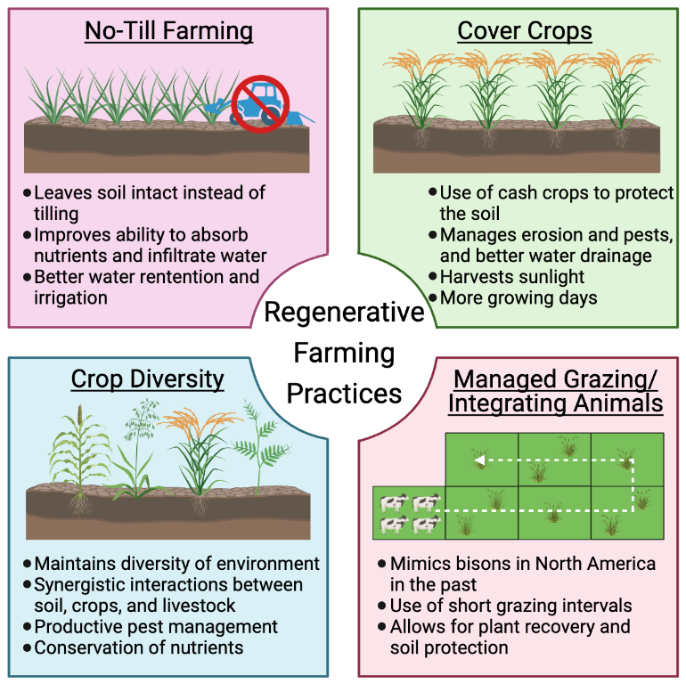
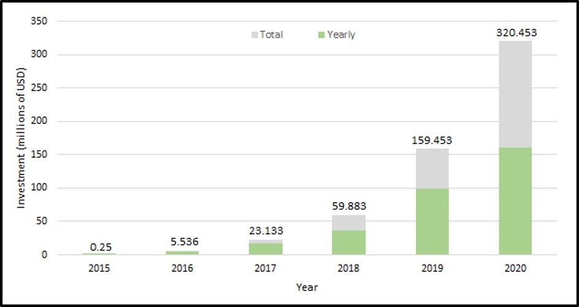

# Eating Meat: The Problem or the Solution? 
## The Potential of Regenerative Agriculture & Cultured Meats to Curb Climate Change
By: Saif Alam, Kristen Arnold, Cohen Bolliger, and Chantelle Castelino 

### To Meat or Not To Meat?

Climate change is one of the most prominent health and social issues of the 21st century (Levy and Patz, 2015). Current literature indicates a strong relationship between the global food production and consumption system and climate change (Patz et al., 2014). Only in recent years have more environment-friendly initiatives been adopted on an individual level, including shifting to vegan and vegetarian diets. Since plant-based approaches may not be the most realistic expectation for most, this article will investigate whether other pragmatic solutions that do not completely eliminate meat consumption from diets can be largely adopted. Namely, we will be assessing whether regenerative agriculture and cultured meats can serve as more practical alternatives to conventionally farmed meat, while also acting as potential solutions to climate change.

### Is the Solution in the Soil?

Regenerative agriculture (RA) describes practices that aim to produce a net positive environmental and social impact (Newton et al., 2020). While these are environment-dependent, several are commonly used throughout the globe, including no-till farming, cover crops, crop diversity, and managed grazing/integrating animals (Figure 1). These sustainable practices all contribute to carbon sequestration, or the transfer of carbon from the atmosphere into the soil, which is the primary method whereby RA combats climate change.

 <i><b> Figure 1: </b> Regenerative agriculture practices of no-till farming, cover crops, crop diversity, and managed grazing. Each practice contributes to carbon sequestration in a unique way. Figure created by authors.</i>

From a financial perspective, RA reduces various input costs associated with conventional agriculture, including tillage equipment, fuel, and chemicals, while also having been shown to produce higher profits (Al‐Kaisi and Lal, 2020; LaCanne and Lundgren, 2018). However, with analyses on the economic viability of widespread RA implementation currently unavailable, it has limited our ability to assess its potential on a global scale. 

### Can Cultured Meats Cure Climate Change?

Cultured meat (CM) is an emerging technology whereby meats are grown in a laboratory setting from stem cells. Currently, it is used to create ground meats, but producers hope to soon be able to create choice cuts, such as steaks (Gaydhane et al., 2018). While it is challenging to determine the benefits of this technology due to the absence of large-scale production, there is indication to suggest that CMs may offer significant benefits by reducing land and water use, when compared to conventional farming (Mayhall, 2019). CM also has the potential to reduce greenhouse gas emissions, should they be produced using renewable energy sources (Lynch and Pierrehumbert, 2019).

CM faces a number of challenges limiting their feasibility for large-scale production. This  includes technological issues—such as the use of fetal bovine serum, an expensive growth medium which greatly increases the cost of the product and has been difficult to replace—and concerns with public opinion (Choudhury, Tseng and Swartz, 2020). Although a number of studies have shown consumer willingness to try CM, public outreach would be necessary to allay concerns (Bryant, van Nek and Rolland, 2020). Over 30 companies are currently working on CM and have amassed significant investment (Figure 2).

 <i><b> Figure 2: </b> Graph of publicly disclosed investment in CM companies (millions of USD) from 2015-2020. Green bars show the year’s investment and grey bars show the cumulative investment of the previous years. Numbers above each bar show the cumulative investment for each year. Figure created by the authors using data from (Choudhury, Tseng and Swartz, 2020). </i>

### Conclusion

While minimizing meat consumption may be a temporary solution, large-scale change in our agricultural practices may be the key to fighting climate change. There is great promise for both RA and CM as potential solutions – RA serves as an adaptive strategy while CM takes a mitigative approach. Though, further research is required to assess the large-scale implementation of these strategies from a financial, political, and social perspective.

### References 
Al‐Kaisi, M.M. and Lal, R., 2020. Aligning science and policy of regenerative agriculture. Soil Science Society of America Journal, 84(6), pp.1808–1820. https://doi.org/10.1002/saj2.20162.

Bryant, C., van Nek, L. and Rolland, N.C.M., 2020. European Markets for Cultured Meat: A Comparison of Germany and France. Foods (Basel, Switzerland), 9(9). https://doi.org/10.3390/foods9091152.

Choudhury, D., Tseng, T.W. and Swartz, E., 2020. The Business of Cultured Meat. Trends in Biotechnology, 38(6), pp.573–577. https://doi.org/10.1016/j.tibtech.2020.02.012.

Gaydhane, M., Mahanta, U., Sharma, C., Khandelwal, M. and Ramakrishna, S., 2018. Cultured meat: state of the art and future. Biomanufacturing Reviews, 3. https://doi.org/10.1007/s40898-018-0005-1.

LaCanne, C.E. and Lundgren, J.G., 2018. Regenerative agriculture: merging farming and natural resource conservation profitably. PeerJ, 6, p.e4428. https://doi.org/10.7717/peerj.4428.

Levy, B.S. and Patz, J.A., 2015. Climate Change, Human Rights, and Social Justice. Annals of Global Health, 81(3), pp.310–322. https://doi.org/10.1016/j.aogh.2015.08.008.

Lynch, J. and Pierrehumbert, R., 2019. Climate Impacts of Cultured Meat and Beef Cattle. Frontiers in Sustainable Food Systems, [online] 3. https://doi.org/10.3389/fsufs.2019.00005.

Mayhall, T.A., 2019. The Meat of the Matter: Regulating a Laboratory-Grown Alternative H. Thomas Austern Writing Competition Winners. Food and Drug Law Journal, 74(1), pp.151–169.

Newton, P., Civita, N., Frankel-Goldwater, L., Bartel, K. and Johns, C., 2020. What Is Regenerative Agriculture? A Review of Scholar and Practitioner Definitions Based on Processes and Outcomes. Frontiers in Sustainable Food Systems, [online] 4. https://doi.org/10.3389/fsufs.2020.577723.
