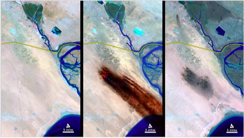

# “When Elephants Fight, It Is the Grass that Suffers”: 

## The Connections Between Climate Change and Conflict

Executive Public Summary

Spencer Arshinoff, Jennifer Ma, Brandon Nicholson, Dua Saqib

March 14th, 2021

ISCI 3A12

## Introduction
Though rarely discussed, military conflicts are a massive contributor to climate change. Here, we will be focusing on three case studies (**Figure 1**) of militarism’s impact on the climate of biodiverse areas (Hanson et al., 2009), by discussing conflicts ingrained in the cultural collective memory.

**Figure 1**: A map showing the locations of the three environmental catastrophes caused by military conflicts that will be discussed in this paper. Map created using Mapchart (Minas, 2021)

## The Nuclear Bombings of Hiroshima and Nagasaki, 1945
The nuclear bombings of Hiroshima and Nagasaki in 1945 during WWII left devastating humanitarian and ecological consequences. On top of the near 160,000 people that were killed, over half of the wildlife within 16 km^2 of each bombing were also wiped out. However, the proliferation of nuclear weapons continued thereafter, with the size of the global arsenal reaching its peak in 1986, as seen in **Figure 2** (Norris & Kristensen, 2010). While even the production and storage of these weapons is known to cause detrimental human and environmental impacts, a war fought with only a small fraction of the world’s current arsenal would result in millions of deaths and a dramatic change in climate. Rapid and extreme global cooling and loss of ozone would lead to mass starvation worldwide. Policies created to reduce the world’s arsenal have had questionable efficacy, making nuclear warfare a continued concern.

**Figure 2**: United States (orange) and Russian (grey) the two largest reported nuclear arsenal sizes from the 1960s to 2010 based on data from Norris & Kristensen (2010).

## The Weaponization of Herbicides in the Vietnam War, 1961- 75
From 1961-75, the Vietnam War brought environmental devastation via deliberate, careless use of the herbicide, Agent Orange (Asia Pacific Curriculum, 2018; Westing, 1983). Approximately half of the commercial forests, crops and mangrove habitats were heavily damaged, resulting in significant biodiversity and economic losses, seen in **Figure 3** (Eyrich, 2018; Orians and Pfeiffer, 1970; Westing, 1983).

**Figure 3**: Estimated areas (1 acre = 0.4 ha) treated with Agent Orange in Vietnam from 1962-1968. The actual area sprayed is unknown as several areas were resprayed and high winds may have spread the herbicide away from the targeted area. Notice that with the peak in defoliation in 1965, the area of crops destroyed skyrockets as well (adapted from Orians and Pfeiffer, 1970).

Clean-up of Agent Orange and dioxin, its toxic impurity, largely fell on Vietnam’s shoulders – despite America being responsible for most of the damage – and has created a lasting barrier to post-war recovery (Eyrich, 2018). Only recently has America started collaborating with Vietnam to fund these expensive and time- and energy-intensive projects (Black, 2019; USAID, 2021). This devastating legacy was also acknowledged by the UN Geneva Conference in 1977, though loopholes in the environmental protection provisions exist, raising questions about their effectiveness (Black, 2019; U.S. Navy, 2007).

## Oil Fires in Kuwait during the Gulf War, 1991
The First Gulf War (1990-91) saw the disastrous effects of using oil as a weapon of war. When withdrawing from the Allied forces, Iraqi troops set fire to and damaged over 700 oil wells, resulting in the largest oil spill in human history (Khordagui and Al-Ajmi, 1993). Crude oil guzzled into the Persian Gulf and across the desert, dramatically affecting the biodiversity and settling into 300 oil lakes. The residue mixed with gravel to create a thick sediment of “tarcrete”, which is poisonous to flora (Koch and El-Baz, 1998). Using Landsat and other satellite data (**Figure 4**), volunteers put out the fires and cleaned the marine environment (Literathy, 1992). The establishment of a post-war claims mechanism, the United Nations Compensation Commission (UNCC), not only helped neighboring states recover from individual losses during the war, but also highlighted the environmental damage caused, which was a step in the right direction (United Nations Compensation Commission, 1991).

**Figure 4**: These Landsat images show the before, during and after the cumulative release of 1.5 billion barrels of oil into the Kuwaiti environment, just south of the Iraq border (yellow line; Gray, 2012)

## Conclusion
The lessons learned from the nuclear bombings of Hiroshima and Nagasaki, the spraying of Agent Orange in Vietnam, and the Kuwaiti oil fires of the Gulf War should clearly demonstrate that militarism puts our environment at risk and shows the need for tougher and more thorough legislation.

## Works Cited

Asia Pacific Curriculum, 2018. _Vietnam After the War_. [online] Asia Pacific Foundation of Canada (APF Canada). Available at: <https://asiapacificcurriculum.ca/learning-module/vietnam-after-war> [Accessed 7 Mar. 2021].

Biegert, C., Hamm, H. and Gunter, L.P. eds., 2020. _Uranium Atlas: Facts and Data about the Raw Material of the Atomic Age_. Translated by C. Rosen. Available at:<https://beyondnuclearinternational.files.wordpress.com/2020/07/uraniumatlas_2020.pdf>.

Black, G., 2019. Fifty Years After, A Daunting Cleanup of Vietnam’s Toxic Legacy. _Yale Environment 360_. [online] 13 May. Available at: <https://e360.yale.edu/features/fifty-years-after-a-daunting-cleanup-of-vietnam-toxic-legacy-dioxin-agent-orange> [Accessed 7 Mar. 2021].

Boyer, P., 1995. Exotic Resonances: Hiroshima in American Memory. _Diplomatic History_, 19(2), pp.297–318.

Brown, O., Hammill, A. and McLeman, R., 2007. Climate change as the ‘new’ security threat: Implications for Africa. _International Affairs_, 83(6), pp.1141–1154.

Burke, M.B., Miguel, E., Satyanath, S., Dykema, J.A. and Lobell, D.B., 2009. Warming increases the risk of civil war in Africa. _Proceedings of the National Academy of Sciences_, 106(49), pp.20670–20674.

Chmielińska, K., Hubé, D., Bausinger, T., Simon, M., Rivière, G., Fauser, P. and Sanderson, H., 2019. Environmental contamination with persistent cyclic mustard gas impurities and transformation products. _Global Security: Health, Science and Policy_, 4(1), pp.14–23.

Collins, S.D., 2015. War-Making as an Environmental Disaster. _New Labor Forum_, 24(2), pp.25–30.

Committee on Uranium Mining in Virginia, Committee on Earth Resources, and National Research Council, 2011. Potential Environmental Effects of Uranium Mining, Processing, and Reclamation. In: _Uranium Mining in Virginia: Scientific, Technical, Environmental, Human Health and Safety, and Regulatory Aspects of Uranium Mining and Processing in Virginia._[online] Washington, DC: National Academies Press. Available at: <http://www.ncbi.nlm.nih.gov/books/NBK201052/> [Accessed 23 Jan. 2021].

Cooke, C.A., Balcom, P.H., Biester, H. and Wolfe, A.P., 2009. Over three millennia of mercury pollution in the Peruvian Andes. _Proceedings of the National Academy of Sciences_, 106(22), pp.8830–8834.

Crowley, K.D. and Ahearne, J.F., 2002. Managing the Environmental Legacy of U.S. Nuclear-Weapons Production: Although the waste from America’s arms buildup will never be ‘cleaned up,’ human and environmental risks can be reduced and managed. _American Scientist_, 90(6), pp.514–523.

Davenport, K., Reif, K. and Kimball, D.G., 2020. _Nuclear Weapons: Who Has What At A Glance._ [online] Arms Control Association. Available at:<https://www.armscontrol.org/factsheets/Nuclearweaponswhohaswhat> [Accessed 7 Mar. 2021].

Ebo, B., 1995. War as Popular Culture: The Gulf Conflict and the Technology of Illusionary Entertainment. _The Journal of American Culture_, 18(3), pp.19–25.

Eyerman, R., 2019. Cultural Trauma, Collective Memory, and the Vietnam War: (with Todd Madigan and Magnus Ring). In: _Memory, Trauma, and Identity_. [online] Cham, Switzerland: Springer International Publishing.pp.143–165. Available at: <http://link.springer.com/10.1007/978-3-030-13507-27> [Accessed 23 Feb. 2021].

Eyrich, T., 2018. The Vietnam War from another angle. _University of California_. [online] 13 Nov. Available at: <https://www.universityofcalifornia.edu/news/vietnam-war-another-angle> [Accessed 7 Mar. 2021].

Gerges, M.A., 1993. On the impacts of the 1991 Gulf War on the environment of the region: General observations. _Marine Pollution Bulletin_, 27, pp.305–314.

Gray, E., 2012. _Landsat Top Ten - Kuwait Oil Fires_. [online] NASA. Available at: <https://www.nasa.gov/mission_pages/landsat/news/40th-top10-kuwait.html> [Accessed 7 Mar. 2021].

Hanson, T., Brooks, T.M., Da Fonseca, G.A.B., Hoffmann, M., Lamoreux, J.F., Machlis, G., Mittermeier, C.G., Mittermeier, R.A. and Pilgrim, J.D., 2009. Warfare in Biodiversity Hotspots. _Conservation Biology_, 23(3), pp.578–587.

Hobbs, P.V. and Radke, L.F., 1992. Airborne Studies of the Smoke from the Kuwait Oil Fires. _Science_, 256(5059), pp.987–991.

Hu, Q.-H., Weng, J.-Q. and Wang, J.-S., 2010. Sources of anthropogenic radionuclides in the environment: a review. _Journal of Environmental Radioactivity_, 101(6), pp.426–437.

International Rescue Committee, 2020. _2021 Emergency Watchlist_. Available at: <https://www.rescue.org/sites/default/files/document/5481/2021emergencywatchlistirc.pdf> [Accessed 23 Feb. 2021].

Katz, E., 2017. Between here and there: Buffer zones in international law. _University of Chicago Law Review_, 84, p.1379.

Khordagui, H. and Al-Ajmi, D., 1993. Environmental impact of the Gulf War: An integrated preliminary assessment. _Environmental Management_, 17(4), pp.557–562.

Koch, M. and El-Baz, F., 1998. Identifying the effects of the Gulf War on the geomorphic features of Kuwait by remote sensing and GIS. _Photogrammetric Engineering and Remote Sensing_, 64(7), pp.739–746.

Kuznick, P., 2016. The Atomic Bomb Didn’t End the War. _U.S. News_. [online] 27 May. Available at: <https://www.usnews.com/opinion/articles/2016-05-27/its-time-to-confront-painful-truths-about-using-the-atomic-bombs-on-japan>.

Lee, I. and Haines, A., 1991. Health costs of the Gulf war. _BMJ_, 303(6797), pp.303–306.

Literathy, P., 1992. Environmental Consequences of the Gulf War in Kuwait: Impact on Water Resources. _Water Science and Technology_, 26(1–2), pp.21–30.

McCurry, J., 2016. Story of cities #24: how Hiroshima rose from the ashes of nuclear destruction. _The Guardian_. [online] 18 Apr. Available at:<https://www.theguardian.com/cities/2016/apr/18/story-of-cities-hiroshima-japan-nuclear-destruction>.

Minas, 2021. MapChart. [online] Available at: <https://mapchart.net/> [Accessed 13 Mar. 2021].

Norris, R.S. and Kristensen, H.M., 2010. Global nuclear weapons inventories, 1945–2010. _Bulletin of the Atomic Scientists_, 66(4), pp.77–83.

Office for Disarmament Affairs, 2020. _Nuclear Weapons_. [online] United Nations. Available at: <https://www.un.org/disarmament/wmd/nuclear/> [Accessed 7 Mar. 2021].

Orians, G.H. and Pfeiffer, E.W., 1970. Ecological Effects of the War in Vietnam. _Science_, 168(3931), pp.544–554.

Orient, J.M., 2014. Fukushima and Reflections on Radiation as a Terror Weapon. _Journal of American Physicians and Surgeons_, 19(2), pp.48–55.

Owen, L.C., 1998. Between Iraq and a Hard Place: The U.N. Compensation Commission and Its Treatment of Gulf War Claims. _Vanderbilt Journal of Transnational Law_, 31, p.499.

Patterson, T.E., 2017. _News coverage of Donald Trump’s first 100 days_. [online] Cambridge, MA: Shorenstein Center on Media, Politics and Public Policy. Available at: <https://shorensteincenter.org/news-coverage-donald-trumps-first- 100 - days/>.

Sagan, C. and Turco, R.P., 1993. Nuclear Winter in the Post-Cold War Era. _Journal of Peace Research_, 30(4), pp.369–373.

Sand, P.H., 2011. Catastrophic Environmental Damage and the Gulf War Reparation Awards: The Experience of the UN Compensation Commission. _Proceedings of the ASIL Annual Meeting_, 105, pp.430–433.

Sawada, S., 2007. Cover-up of the effects of internal exposure by residual radiation from the atomic bombing of Hiroshima and Nagasaki. _Medicine, Conflict and Survival_, 23(1), pp.58–74.

Smith, C.L., Hooks, G. and Lengefeld, M., 2014. The War on Drugs in Colombia: The Environment, the Treadmill of Destruction and Risk-Transfer Militarism. _Journal of World-Systems Research_, pp.185–206.

Storaas, M.V., 2019. _Ecocide, a crime against peace?: A conceptual analysis of world peace from a case of applied ethics on ecosystem harm_. [online] University of Oslo. Available at: <http://hdl.handle.net/10852/70033>.

The United States Strategic Bombing Survey, 1946. _The Effects of Atomic Bombs on Hiroshima and Nagasaki_. Washington, D.C, United States: United States Government Printing Office.

Toon, O.B., Robock, A. and Turco, R.P., 2008. Environmental consequences of nuclear war. _Physics Today_, 61(12), pp.37–42.

_Treaty on the Non-Proliferation of Nuclear Weapons (NPT)_. 1968. [online]. Opened for signature 1968, entered into force 1970. [Accessed 07 March 2021]

United Nations Compensation Commission, 1991. _Resolution 687_. Available at: <https://uncc.ch/sites/default/files/attachments/documents/res0687.pdf>.

U.S. Navy, 2007. _The Commander’s Handbook on the Law of Naval Operations_. [online] Monterey, CA, USA: United States Department of the Navy. Available at:
<https://www.marines.mil/Portals/1/Publications/MCTP%2011-10B%20(%20Formerly%20MCWP%205-12.1).pdf?ver=2017-07-11-151548-683>.

USAID, 2021. _Environmental Remediation of Dioxin Contamination at Danang Airport Project Frequently Asked Questions_. [online] United States Agency for International Development. Available at: <https://www.usaid.gov/vietnam/environmental-remediation-dioxin-contamination-danang-airport-project-frequently-asked-questions> [Accessed 7 Mar. 2021].

Weinberg, G.L., 1994. _A world at arms: A global history of World War II_. Cambridge: Cambridge University Press.

Westing, A.H., 1981. Environmental Impact of Nuclear Warfare. _Environmental Conservation_, 8(4), pp.269–273.

Westing, A.H., 1983. The Environmental Aftermath of Warfare in Viet Nam. _Natural Resources Journal_, 23(2), pp.365–389.

Wood, L., 2015. _The Environmental Impacts of Colonialism_. [online] Bridgewater State University. Available at: <https://vc.bridgew.edu/honors_proj/119>.
